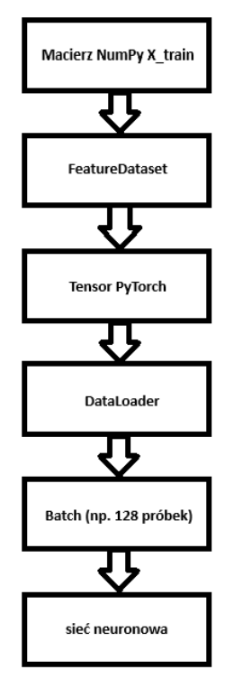

# Lab – Lego Challenge

## Cel projektu

Celem projektu było stworzenie wielomodelowego systemu klasyfikacji kolorów
klocków LEGO na podstawie wartości pikseli RGB oraz ich rozszerzonych reprezentacji
cechowych. System miał:

- klasyfikować kolory LEGO na podstawie 14 cech inżynierii cech,
- porównać klasyczne modele ML z modelami głębokiego uczenia,
- wykorzystać autoenkodery (MLP i CNN) do redukcji wymiarowości,
- zastosować transformer jako model sekwencyjny dla cech,
- umożliwić interaktywną analizę obrazu poprzez GUI i kliknięcia pikseli.

## Zbiór danych

Projekt wykorzystuje dane z plików:

- legocolor-extended.csv – główny zbiór RGB + etykiety kolorów,
- colors.csv – dodatkowe informacje o kolorach (opcjonalne).
Każdy rekord zawiera:
- wartości RGB,
- nazwę koloru LEGO.
Dane zostały oczyszczone (usunięcie braków, konwersja typów) i przygotowane do
dalszej analizy.

Kod:

1. Funkcja load_data()

```python
def load_data():
print(">>> Wczytywanie danych...")
df_data = pd.read_csv(FILE_MAIN, delimiter=";")
print("Kształt df_data:", df_data.shape)
```

Wczytywany jest plik legocolor-extended.csv, który znajduje się w folderze archive/. Po
uruchomieniu programu otrzymujemy: "Kształt df_data: (2492, 17), co oznacza 2492
wiersze (próbki) i 17 kolumn. Każdy wiersz odpowiada jednej próbce koloru LEGO.
Parametr delimiter=";" oznacza, że wartości w pliku są rozdzielone średnikami.

2. Funkcja prepare_data()

```python
def prepare_data(df_data, df_color):
    print("\n>>> Przygotowanie danych...")

    if "Color" not in df_data.columns:
        raise ValueError("Brak kolumny 'Color' w legocolor-extended.csv")

    for c in ["R", "G", "B"]:
        df_data[c] = pd.to_numeric(df_data[c], errors="coerce")

    df_data = df_data.dropna(subset=["R", "G", "B", "Color"])
    df_data[["R", "G", "B"]] = df_data[["R", "G", "B"]].astype(int)

    print("Generowanie 14 cech informacyjnych...")
    feats = {col: [] for col in FEATURE_COLS_14}
    for r, g, b in zip(df_data["R"], df_data["G"], df_data["B"]):
        fd = compute_color_spaces(r, g, b)
        for col in FEATURE_COLS_14:
            feats[col].append(fd[col])

    for col in FEATURE_COLS_14:
        df_data[col] = feats[col]

    print("Dostępne klasy (kolory):", df_data["Color"].unique())
    print("Używane kolumny cech:", FEATURE_COLS_14)

    return df_data
```

Funkcja prepare_data() odpowiada za przygotowanie zbioru danych do procesu uczenia
modeli. W pierwszej kolejności sprawdza, czy w pliku znajduje się kolumna „Color”,
zawierająca etykiety klas (nazwy kolorów LEGO). Następnie konwertuje wartości
kanałów R, G i B na dane numeryczne oraz usuwa rekordy zawierające brakujące lub
niepoprawne wartości.

Po oczyszczeniu danych funkcja generuje dla każdego koloru zestaw 14 cech
informacyjnych. Oprócz podstawowych wartości RGB wyznaczane są cechy


pochodzące z innych przestrzeni barw (HSV oraz YUV), znormalizowane składowe RGB
oraz dodatkowe parametry opisujące kolor, takie jak różnica między kanałami
czerwonym i zielonym (Dist_RG) oraz wskaźnik nasycenia (SatIndex).

Wygenerowane cechy są następnie dodawane jako nowe kolumny do zbioru danych.
Na końcu funkcja wyświetla listę dostępnych klas kolorów oraz zestaw
wykorzystywanych cech, po czym zwraca kompletny, oczyszczony i rozszerzony zbiór
danych gotowy do dalszego podziału na zbiór treningowy i testowy oraz do trenowania
modeli uczenia maszynowego.

## Inżynieria cech (14 cech)

Z każdego piksela RGB generowane są 14 cech:

Podstawowe RGB:

- R, G, B

Przestrzenie kolorów:

- Hue, Saturation, Value (HSV)
- Y, U, V (YUV)

Normalizacja:

- R_norm, G_norm, B_norm

Cechy dodatkowe:

- Dist_RG (różnica R-G)
- SatIndex (indeks nasycenia)

Kod:

```python
def compute_color_spaces(r, g, b):
    # HSV
    h, s, v = colorsys.rgb_to_hsv(r / 255.0, g / 255.0, b / 255.0)
    h_deg = h * 360.0
    s_255 = s * 255.0
    v_255 = v * 255.0

    # YUV
    y = 0.299 * r + 0.587 * g + 0.114 * b
    u = -0.14713 * r - 0.28886 * g + 0.436 * b
    v_yuv = 0.615 * r - 0.51499 * g - 0.10001 * b
```

**1. Normalizacja RGB -> HSV**

```python
h, s, v = colorsys.rgb_to_hsv(r / 255.0, g / 255.0, b / 255.0)
```

RGB to:

- przestrzeń techniczna (kamera)
HSV to:
- przestrzeń ludzka percepcja koloru

_HSV:_

- H (Hue) → kąt na kole barw (0–360°)
- S (Saturation) → czystość koloru
- V (Value) → jasność

Zamiast (R, G, B) otrzymujemy, jaki to jest kolor i jak intensywny

**2. Skalowanie HSV**

```python
    h_deg = h * 360.0
    s_255 = s * 255.0
    v_255 = v * 255.0
```

HSV z biblioteki jest w zakresie 0- 1

Modele ML lepiej działają na "ludzkich zakresach" (cechy powinny być w podobnych,
małych skalach (np. 0–1 lub standaryzowane), bo modele ML nie radzą sobie z dużymi
różnicami wartości między cechami).

**3. YUV – model światła**

```python
y = 0.299 * r + 0.587 * g + 0.114 * b
```

To jest fizyczny model luminancji:

- Zielony ma największy wpływ na jasność
- Czerwony średni
- Niebieski najmniejszy

Y = jasność

```python
    u = -0.14713 * r - 0.28886 * g + 0.436 * b
    v_yuv = 0.615 * r - 0.51499 * g - 0.10001 * b
```

U i V opisują odcień koloru i oddzielają kolor od jasności


Model dostaje nie tylko RGB, ale też percepcję (HSV), fizykę światła (YUV),
normalizację, czyli 3 różne perspektywy koloru.

## Normalizacja RGB + cechy dodatkowe

```python
    s_rgb = r + g + b
    if s_rgb == 0:
        r_norm = g_norm = b_norm = 0.0
    else:
        r_norm = r / s_rgb
        g_norm = g / s_rgb
        b_norm = b / s_rgb
```

Ten kod zamienia RGB na wersję znormalizowaną, RGB mówi, ile jest światła
czerwonego, zielonego i niebieskiego, ale RGB nie zależy od jasności.

Przykład:

kolor RGB
ciemny czerwony (100, 0, 0)
Jasny czerwony (200, 0, 0)
to ten sam kolor, ale inne wartości

1. Suma kanałów

```python
s_rgb = r + g + b
```

To mówi, ile łącznie światła jest w pikselu.

2. Podział przed sumę

```python
        r_norm = r / s_rgb
        g_norm = g / s_rgb
        b_norm = b / s_rgb
```

Zamiast absolutnych wartości jest udział kanałów:

```python
r_norm = g_norm = b_norm = 1
```

3. Warunek s_rgb == 0

```python
    if s_rgb == 0:
        r_norm = g_norm = b_norm = 0.0
```

Jeżeli R=0, G=0, B=0 to będzie czarny piksel.

4. DITS_RG

```python
dist_rg = abs(r - g)
```

Mierzy różnicę miedzy czerwonym i zielonym, pomaga rozróżniać czerwony vs żółty vs
pomarańczowy.

5. SAT INDEX

```python
sat_index = 0.0 if max_c == 0 else (max_c - min_c) / max_c
```

0 – szary

1 – bardzo czysty kolor

## Modele klasyczne

Zastosowane modele:

- Logistic Regression
- KNN
- Random Forest
- Gradient Boosting
- SVC (RBF)
- Linear SVC
- Perceptron
- MLP
- Gaussian Naive Bayes

Metoda oceny:

- 5 - fold cross validation
- metryka: accuracy

Wynik:

Najlepszy model wybierany jest automatycznie na podstawie średniej CV accuracy.

Kod

1. Funkcja train_and_select_classical_models

```python
def train_and_select_classical_models(X_train, y_train):
    print("\n>>> Trening klasycznych modeli i wybór najlepszego...")

    scaler = StandardScaler()
    X_train_scaled = scaler.fit_transform(X_train)

    # USUNIĘTO multi_class="auto" (zapobieganie FutureWarning w scikit-learn >= 1.5)
    models = {
        "LogisticRegression": LogisticRegression(max_iter=1000),
        "KNN": KNeighborsClassifier(n_neighbors=5),
        "RandomForest": RandomForestClassifier(n_estimators=200, random_state=42),
        "GradientBoosting": GradientBoostingClassifier(random_state=42),
        "SVC_RBF": SVC(kernel="rbf", C=5, gamma="scale", probability=False),
        "LinearSVC": LinearSVC(C=1.0),
        "Perceptron": Perceptron(max_iter=1000, random_state=42),
        "MLP": MLPClassifier(hidden_layer_sizes=(64, 32), max_iter=500, random_state=42),
        "GaussianNB": GaussianNB()
    }

    results = []

    for name, model in models.items():
        try:
            scores = cross_val_score(model, X_train_scaled, y_train, cv=5, scoring="accuracy")
            mean_acc = scores.mean()
            results.append((name, mean_acc))
            print(f"Model: {name:18s} | CV Accuracy: {mean_acc:.4f}")
        except Exception as e:
            print(f"Model: {name:18s} | BŁĄD w treningu: {e}")

    results = [r for r in results if not np.isnan(r[1])]
    results.sort(key=lambda x: x[1], reverse=True)

    best_name, best_score = results[0]
    best_model = models[best_name]
    best_model.fit(X_train_scaled, y_train)

    print(f"\n>>> Najlepszy klasyczny model: {best_name} (CV Accuracy = {best_score:.4f})")

    return best_model, scaler, results, X_train_scaled
```

Funkcja odpowiada za kompleksowy proces trenowania oraz porównania klasycznych
modeli uczenia maszynowego, a następnie wybór najlepszego z nich.

Na początku dane wejściowe (X_train) są standaryzowane przy użyciu
StandardScaler, co zapewnia ujednolicenie skali cech i poprawia stabilność wielu
algorytmów ML.

Następnie definiowany jest zestaw klasycznych modeli uczenia maszynowego,
obejmujący algorytmy liniowe, probabilistyczne, oparte o najbliższych sąsiadów,
maszyny wektorów nośnych, modele drzewiaste oraz prostą sieć neuronową.

Dla każdego modelu przeprowadzana jest 5-krotna walidacja krzyżowa
(cross_val_score) z metryką accuracy, co pozwala ocenić jego zdolność do
generalizacji. Wyniki są zapisywane i porównywane.


Po zakończeniu oceny wszystkich modeli wybierany jest najlepszy model na podstawie
średniej dokładności z walidacji krzyżowej. Model ten jest następnie trenowany na
całym zbiorze treningowym.

Funkcja zwraca:

- najlepszy model,
- obiekt skalera,
- listę wyników wszystkich modeli,
- przeskalowany zbiór treningowy.
2. Funkcja evaluate_model

```python
def evaluate_model(model, scaler, X_test, y_test, label_encoder):
    print("\n>>> Ewaluacja najlepszego klasycznego modelu...")

    X_test_scaled = scaler.transform(X_test)
    y_pred = model.predict(X_test_scaled)

    acc = accuracy_score(y_test, y_pred)
    prec = precision_score(y_test, y_pred, average="weighted", zero_division=0)
    rec = recall_score(y_test, y_pred, average="weighted", zero_division=0)
    f1 = f1_score(y_test, y_pred, average="weighted", zero_division=0)

    print(f"Accuracy : {acc:.4f}")
    print(f"Precision: {prec:.4f}")
    print(f"Recall   : {rec:.4f}")
    print(f"F1-score : {f1:.4f}")

    print("\n>>> Raport klasyfikacji (klasyczny model):")
    print(classification_report(y_test, y_pred, target_names=label_encoder.classes_, zero_division=0))

    cm = confusion_matrix(y_test, y_pred)
    plt.figure(figsize=(8, 6))
    sns.heatmap(cm, annot=False, cmap="Blues")
    plt.title("Confusion Matrix – klasyczny model (14 cech)")
    plt.xlabel("Predicted")
    plt.ylabel("True")
    plt.tight_layout()
    plt.show()

    return acc, prec, rec, f1, y_pred
```

Funkcja służy do oceny finalnego, wybranego modelu klasycznego na zbiorze
testowym.

Na początku dane testowe są przekształcane przy użyciu wcześniej dopasowanego
skalera, aby zachować spójność transformacji z danymi treningowymi.

Następnie model generuje predykcje dla zbioru testowego. Na ich podstawie obliczane
są podstawowe metryki jakości klasyfikacji: accuracy, precision, recall oraz F1-score,
przy użyciu średniej ważonej.


Dodatkowo generowany jest szczegółowy raport klasyfikacji (classification_report),
który przedstawia jakość predykcji dla każdej klasy osobno.

Funkcja tworzy również macierz pomyłek (confusion matrix), która jest wizualizowana
za pomocą mapy cieplnej, co umożliwia analizę błędów klasyfikatora.

Na końcu funkcja zwraca obliczone metryki oraz predykcje modelu.

3. Funkcja plot_feature_importance

```python
def plot_feature_importance(model, feature_names):
    if hasattr(model, "feature_importances_"):
        importances = model.feature_importances_
        plt.figure(figsize=(6, 4))
        sns.barplot(x=importances, y=feature_names, orient="h")
        plt.title("Feature Importance (model drzewiasty)")
        plt.tight_layout()
        plt.show()
    else:
        print("Model nie posiada atrybutu feature_importances_ – pomijam wykres.")
```

Funkcja służy do wizualizacji ważności cech wejściowych w modelu, o ile dany model
udostępnia atrybut feature_importances_.

Jeżeli model posiada ten atrybut (co jest typowe dla modeli drzewiastych, takich jak
Random Forest czy Gradient Boosting), funkcja pobiera wartości ważności cech i
przedstawia je w formie wykresu słupkowego.

Wykres umożliwia interpretację wpływu poszczególnych cech na decyzje modelu.

Jeżeli model nie udostępnia informacji o ważności cech, funkcja informuje o braku
możliwości wygenerowania wykresu i kończy działanie.

Podsumowanie

Cały fragment kodu realizuje kompletny pipeline klasycznego uczenia maszynowego:

- train_and_select_classical_models → porównanie i wybór modelu
- evaluate_model → ocena jakości najlepszego modelu
- plot_feature_importance → interpretacja modelu (jeśli możliwa)

## Przygotowanie danych dla PyTorch

W projekcie dane początkowo znajdują się w postaci tablic NumPy: x_train _,_ x_test oraz
etykiet y_train _,_ y_test. Natomiast modele PyTorch nie pracują bezpośrednio na
tablicach NumPy, ale na obiektach typu: torch.Tensor, dlatego jest potrzebna klasa,


która zamieni dane do odpowiedniego formatu i umożliwi ich wygodne pobieranie
podczas treningu.

Kod

1. Definicja klasy

```python
class FeatureDataset(Dataset)
```

Klasa dziedziczy po Dataset z modułu torch.utils.data. Oznacza to, że staje się własnym
zbiorem danych zgodnym z wymaganiami PyTorch.

2. Konstruktor __init__

```python
def __init__(self, X, y=None)
```

Konstruktor jest wywoływany podczas tworzenia obiektu klasy. Przykład:

```
Dataset = FeatureDataset(x_train , y_train)
```
Parametry:

- x – macierz cech wejściowych
- y – etykiety klas (opcjonalne)
3. Konwersja danych do tensorów

```python
self.X = torch.tensor(X, dtype=torch.float32)
```

Dane wejściowe są zamieniane na tensor PyTorch typu float32. Typ float32 jest
standardowo wykorzystywany podczas obliczeń w sieciach neuronowych.

4. Konwersja etykiet klas

```python
self.y = None if y is None else torch.tensor(y, dtype=torch.long)
```

Tutaj sprawdzane jest, czy przekazano etykiety. Jeżeli y is None to self.y = None,
przypadek taki występuje np. podczas kodowania danych przez autoenkoder, gdzie
potrzebne są jedynie cechy wejściowe. Jeżeli etykiety istnieją (y = [0, 2, 1, 5]) to zostaną
zamienione na tensor (tensor([0, 2, 1, 5])) o typie torch.long, typ long jest wymagany
przez funkcję CrossEntropyLoss() wykorzstywaną w klasyfikacji.

5. Metoda __len__

```python
def __len__(self):
    return self.X.shape[0]
```

Zwraca liczbę próbek znajdujących się w zbiorze danych.

6. Metoda __getitem__

```python
def __getitem__(self, idx):
    if self.y is None:
        return self.X[idx]
    return self.X[idx], self.y[idx]
```

Metoda odpowiada za pobranie pojedynczej próbki o indeksie idx.

**Jak wykorzystywana jest ta klasa?**

```python
dataset = FeatureDataset(X_train_scaled)
loader = DataLoader(dataset, batch_size=batch_size, shuffle=True)
```

FeatureDataset(X_train_scaled) tworzy dataset – tylko cechy X, bez etykiet y, ponieważ
enkoder uczy się rekonstrukcji.

Tworzony jest DataLoader, który dzieli dane na batch'e i losuje kolejność (shuffle=True).

W treningu PyTorch automatycznie wywołuje __getitem __, który pobiera kolejne próbki i
tworzy batch

Schemat działania

<div align="center">
  
</div>

## Autoenkoder MLP (14 cech)

Zastosowano sieć:

- Encoder: 14 → 64 → latent (8)
- Decoder: latent → 64 → 14

Cel:

- redukcja wymiarowości,
- wyuczenie ukrytej reprezentacji koloru.

Następnie:

- latent → RandomForest → klasyfikacja

Kod

1. Klasa Autoencoder

```python
class Autoencoder(nn.Module):
    def __init__(self, input_dim, latent_dim=8):
        super().__init__()
        self.encoder = nn.Sequential(
            nn.Linear(input_dim, 64),
            nn.ReLU(),
            nn.Linear(64, latent_dim)
        )
        self.decoder = nn.Sequential(
            nn.Linear(latent_dim, 64),
            nn.ReLU(),
            nn.Linear(64, input_dim)
        )

    def forward(self, x):
        z = self.encoder(x)
        x_rec = self.decoder(z)
        return x_rec, z
```

Klasa Autoencoder definiuje prosty autoenkoder oparty na sieci neuronowej MLP,
którego zadaniem jest nauczenie się kompresji i rekonstrukcji danych wejściowych.
Model składa się z dwóch głównych części: enkodera oraz dekodera. Enkoder przyjmuje
dane o wymiarze input_dim (np. 14 cech opisujących kolory LEGO) i przekształca je
najpierw do przestrzeni o większej liczbie neuronów (64), a następnie redukuje ich
wymiar do postaci latentnej latent_dim, tworząc skompresowaną reprezentację
danych. W tym etapie wykorzystywana jest nieliniowa funkcja aktywacji ReLU, która
pozwala modelowi uczyć się bardziej złożonych zależności między cechami. Następnie
dekoder wykonuje proces odwrotny — przekształca wektor latentny z powrotem do
przestrzeni o wymiarze oryginalnych danych, próbując odtworzyć wejście. W metodzie
forward dane wejściowe przechodzą przez enkoder, gdzie powstaje wektor latentny z,
który następnie jest przekazywany do dekodera w celu rekonstrukcji x_rec. Model
zwraca zarówno odtworzone dane, jak i reprezentację latentną, co umożliwia
wykorzystanie go zarówno do rekonstrukcji, jak i redukcji wymiarowości danych.

2. Funkcja train_autoencoder

```python
def train_autoencoder(X_train_scaled, input_dim, latent_dim=8, epochs=20, batch_size=128, lr=1e-3):
    print("\n>>> Trening MLP autoenkodera na 14 cechach...")
    dataset = FeatureDataset(X_train_scaled)
    loader = DataLoader(dataset, batch_size=batch_size, shuffle=True)

    model = Autoencoder(input_dim=input_dim, latent_dim=latent_dim).to(DEVICE)
    criterion = nn.MSELoss()
    optimizer = optim.Adam(model.parameters(), lr=lr)

    model.train()
    for epoch in range(1, epochs + 1):
        total_loss = 0.0
        for batch in loader:
            batch = batch.to(DEVICE)
            optimizer.zero_grad()
            x_rec, _ = model(batch)
            loss = criterion(x_rec, batch)
            loss.backward()
            optimizer.step()
            total_loss += loss.item() * batch.size(0)
        avg_loss = total_loss / len(dataset)
        print(f"Epoch {epoch:02d}/{epochs} | AE loss: {avg_loss:.6f}")

    return model
```

Funkcja train_autoencoder odpowiada za pełny proces uczenia autoenkodera MLP
na przygotowanych 14 cechach opisujących kolory LEGO. Na początku dane wejściowe
X_train_scaled są opakowywane w klasę FeatureDataset, która umożliwia ich
obsługę przez PyTorch, a następnie przekazywane do DataLoader, który dzieli je na
mini-batche i losowo miesza dane w trakcie treningu. Następnie tworzony jest model
autoenkodera o zadanym wymiarze wejściowym input_dim i wymiarze latentnym
latent_dim, który przenoszony jest na wybrane urządzenie obliczeniowe (CPU/GPU).
Do uczenia modelu wykorzystywana jest funkcja straty MSE (Mean Squared Error), która
mierzy różnicę pomiędzy danymi wejściowymi a ich rekonstrukcją, oraz optymalizator
Adam, odpowiedzialny za aktualizację wag sieci na podstawie gradientów błędu.

Proces uczenia przebiega w pętli po epokach, gdzie dla każdej epoki model przetwarza
kolejne batch’e danych: wykonuje propagację w przód, generując rekonstrukcję
wejścia, oblicza błąd rekonstrukcji, a następnie wykonuje propagację wsteczną w celu
aktualizacji wag. W trakcie każdej epoki akumulowany jest całkowity błąd, który
następnie jest uśredniany i wypisywany jako informacja o postępie uczenia. Dzięki
temu możliwe jest monitorowanie procesu uczenia i ocena, czy model poprawnie uczy
się kompresji danych. Po zakończeniu treningu funkcja zwraca wytrenowany model
autoenkodera, który może być wykorzystany do ekstrakcji reprezentacji latentnych lub
rekonstrukcji danych wejściowych.

3. encode_with ___ autoencoder

```python
def encode_with_autoencoder(model, X_scaled):
    model.eval()
    dataset = FeatureDataset(X_scaled)
    loader = DataLoader(dataset, batch_size=256, shuffle=False)
    zs = []
    with torch.no_grad():
        for batch in loader:
            batch = batch.to(DEVICE)
            _, z = model(batch)
            zs.append(z.cpu().numpy())
    Z = np.vstack(zs)
    return Z
```

Funkcja encode_with_autoencoder służy do przekształcenia danych wejściowych do
przestrzeni latentnej (ukrytej reprezentacji) przy użyciu wcześniej wytrenowanego
autoenkodera MLP. Na początku model przełączany jest w tryb ewaluacji
(model.eval()), co wyłącza mechanizmy treningowe takie jak dropout i zapewnia
stabilne działanie sieci. Następnie dane X_scaled są opakowywane w klasę
FeatureDataset, a potem przekazywane do DataLoader, który dzieli je na batch’e (w tym
przypadku po 256 próbek) bez losowego mieszania, ponieważ zachowanie kolejności
danych jest istotne podczas kodowania.

W kolejnym kroku funkcja przechodzi przez wszystkie batch’e danych w trybie
torch.no_grad(), co oznacza, że PyTorch nie zapisuje gradientów, ponieważ nie jest
wykonywany trening, a jedynie inferencja. Dla każdego batcha dane są przenoszone na
odpowiednie urządzenie obliczeniowe, a następnie przepuszczane przez autoenkoder.
Z modelu pobierana jest jedynie część latentna z, czyli skompresowana reprezentacja
danych, natomiast rekonstrukcja wejścia jest ignorowana. Otrzymane wektory latentne
są konwertowane do formatu NumPy i dodawane do listy wyników.

Na końcu wszystkie batch’e są łączone pionowo funkcją np.vstack, tworząc jedną
macierz Z, która zawiera latentne reprezentacje wszystkich próbek. Wynikowa macierz
stanowi nową, zredukowaną reprezentację danych, która może być dalej wykorzystana
np. do klasyfikacji (np. Random Forest) lub wizualizacji.

## Transformer dla cech

Zastosowano prosty transformer:

- projekcja cech do d_model = 64
- encoder transformerowy
- global average pooling
- klasyfikacja softmax


Traktowanie 14 cech jako „sekwencji cech”, a nie wektora statycznego.

Kod

1. Klasa FeatureTransformerClassifier

```python
class FeatureTransformerClassifier(nn.Module):
    def __init__(self, input_dim, num_classes, d_model=64, nhead=4, num_layers=2, dim_feedforward=128):
        super().__init__()
        self.proj = nn.Linear(input_dim, d_model)
        encoder_layer = nn.TransformerEncoderLayer(
            d_model=d_model,
            nhead=nhead,
            dim_feedforward=dim_feedforward,
            batch_first=True
        )
        self.encoder = nn.TransformerEncoder(encoder_layer, num_layers=num_layers)
        self.cls_head = nn.Linear(d_model, num_classes)

    def forward(self, x):
        x = self.proj(x)
        x = x.unsqueeze(1)
        x = self.encoder(x)
        x = x.mean(dim=1)
        logits = self.cls_head(x)
        return logits
```

To klasa definiująca model klasyfikacyjny oparty na architekturze Transformer,
zaimplementowany w PyTorch.

Model składa się z trzech głównych części:

1. Projekcja wejścia (self.proj)
Warstwa liniowa (nn.Linear), która przekształca wejściowy wektor cech o wymiarze
input_dim do przestrzeni ukrytej o wymiarze d_model. Dzięki temu dane są
dopasowane do wymagań transformera.
2. Encoder Transformer (self.encoder)
Właściwa część modelu oparta na nn.TransformerEncoder. Składa się z num_layers
warstw enkodera, z których każda zawiera mechanizm multi-head self-attention
(nhead) oraz sieć feed-forward (dim_feedforward).
Model analizuje zależności między cechami w reprezentacji sekwencyjnej.
3. Warstwa klasyfikacyjna (self.cls_head)
Warstwa liniowa mapująca reprezentację ukrytą (d_model) na liczbę klas
(num_classes).

Forward pass

W metodzie forward:

1. Dane wejściowe są rzutowane do przestrzeni d_model.


2. Dodawany jest wymiar sekwencji (unsqueeze(1)), traktując cały wektor cech
    jako sekwencję długości 1.
3. Dane przechodzą przez encoder Transformer.
4. Następuje uśrednienie po wymiarze sekwencji.
5. Wynik trafia do warstwy klasyfikacyjnej, która zwraca logity.

2. Funkcja train_transformer_classifier

```python
def train_transformer_classifier(X_train_scaled, y_train, input_dim, num_classes,
                                 epochs=20, batch_size=128, lr=1e-3):
    print("\n>>> Trening transformerowego klasyfikatora cech...")
    dataset = FeatureDataset(X_train_scaled, y_train)
    loader = DataLoader(dataset, batch_size=batch_size, shuffle=True)

    model = FeatureTransformerClassifier(input_dim=input_dim, num_classes=num_classes).to(DEVICE)
    criterion = nn.CrossEntropyLoss()
    optimizer = optim.Adam(model.parameters(), lr=lr)

    model.train()
    for epoch in range(1, epochs + 1):
        total_loss = 0.0
        correct = 0
        total = 0
        for Xb, yb in loader:
            Xb = Xb.to(DEVICE)
            yb = yb.to(DEVICE)
            optimizer.zero_grad()
            logits = model(Xb)
            loss = criterion(logits, yb)
            loss.backward()
            optimizer.step()
            total_loss += loss.item() * Xb.size(0)
            preds = logits.argmax(dim=1)
            correct += (preds == yb).sum().item()
            total += yb.size(0)
        avg_loss = total_loss / len(dataset)
        acc = correct / total
        print(f"Epoch {epoch:02d}/{epochs} | Loss: {avg_loss:.4f} | Acc: {acc:.4f}")

    return model
```

Funkcja odpowiada za trenowanie modelu Transformerowego.

Działanie krok po kroku:

1. Tworzy obiekt FeatureDataset z danych treningowych.
2. Opakowuje dane w DataLoader, który umożliwia batchowanie i losowe
    mieszanie danych.
3. Inicjalizuje model FeatureTransformerClassifier i przenosi go na urządzenie
    (DEVICE).
4. Definiuje:
    a. funkcję straty: CrossEntropyLoss (dla klasyfikacji wieloklasowej),
    b. optymalizator: Adam.


Pętla treningowa:

Dla każdej epoki:

- model przetwarza batch danych,
- obliczana jest strata,
- wykonywany jest backpropagation,
- aktualizowane są wagi,
- zbierane są statystyki (loss i accuracy).
Na końcu każdej epoki wypisywane są:
- średnia strata,
- dokładność klasyfikacji.
Funkcja zwraca wytrenowany model.

3. Funkcja evaluate_transformer

```python
def evaluate_transformer(model, X_test_scaled, y_test):
    model.eval()
    dataset = FeatureDataset(X_test_scaled, y_test)
    loader = DataLoader(dataset, batch_size=256, shuffle=False)

    all_preds = []
    all_true = []
    with torch.no_grad():
        for Xb, yb in loader:
            Xb = Xb.to(DEVICE)
            logits = model(Xb)
            preds = logits.argmax(dim=1).cpu().numpy()
            all_preds.append(preds)
            all_true.append(yb.numpy())
    y_pred = np.concatenate(all_preds)
    y_true = np.concatenate(all_true)

    acc = accuracy_score(y_true, y_pred)
    prec = precision_score(y_true, y_pred, average="weighted", zero_division=0)
    rec = recall_score(y_true, y_pred, average="weighted", zero_division=0)
    f1 = f1_score(y_true, y_pred, average="weighted", zero_division=0)

    print("\n>>> Transformer – wyniki na zbiorze testowym:")
    print(f"Accuracy : {acc:.4f}")
    print(f"Precision: {prec:.4f}")
    print(f"Recall   : {rec:.4f}")
    print(f"F1-score : {f1:.4f}")

    return acc, prec, rec, f1, y_pred
```

Funkcja służy do oceny wytrenowanego modelu na zbiorze testowym.

Działanie:

1. Ustawia model w tryb ewaluacji (model.eval()).
2. Tworzy dataset i DataLoader dla danych testowych.


3. Przechodzi przez dane bez gradientów (torch.no_grad()), aby:
    a. wygenerować predykcje,
    b. zebrać etykiety rzeczywiste.
4. Łączy wyniki z batchy w pełne tablice NumPy.

Metryki:

Obliczane są standardowe miary jakości klasyfikacji:

- Accuracy
- Precision (weighted)
- Recall (weighted)
- F1-score (weighted)
Na końcu wyniki są wypisywane i zwracane.

## CNN Autoencoder (11x11 patch)

Dane wejściowe:

- wycinki obrazu 11×11 pikseli

Model:

- encoder CNN (Conv + MaxPool)
- latent vector (8D)
- decoder (ConvTranspose)

Cel:

- uwzględnienie tekstury plastiku LEGO
- odporność na szum i oświetlenie

Dodatkowo:

Generowane są syntetyczne patche z:

- gradientem światła
- szumem aparatu

Kod

1. Funkcja extract_real_patch

```python
PATCH_SIZE = 11
LATENT_DIM_CNN = 8


def extract_real_patch(img_np, x, y, patch_size=11):
    h, w, _ = img_np.shape
    half = patch_size // 2

    y_start = max(0, y - half)
    y_end = min(h, y + half + 1)
    x_start = max(0, x - half)
    x_end = min(w, x + half + 1)

    patch = img_np[y_start:y_end, x_start:x_end]

    if patch.shape[0] != patch_size or patch.shape[1] != patch_size:
        padded_patch = np.zeros((patch_size, patch_size, 3), dtype=img_np.dtype)
        t_y_start = half - (y - y_start)
        t_y_end = t_y_start + (y_end - y_start)
        t_x_start = half - (x - x_start)
        t_x_end = t_x_start + (x_end - x_start)
        padded_patch[t_y_start:t_y_end, t_x_start:t_x_end] = patch
        patch = padded_patch

    return patch.transpose(2, 0, 1).astype(np.float32) / 255.0
```

Funkcja służy do bezpiecznego wycinania fragmentów obrazu o stałym rozmiarze 11×
pikseli wokół wskazanego punktu (x, y). Najpierw wyznaczany jest obszar wycinka z
uwzględnieniem granic obrazu, aby uniknąć wyjścia poza jego zakres. Następnie
pobierany jest odpowiedni fragment obrazu. W przypadku gdy wycięty patch ma zbyt
mały rozmiar (np. przy krawędziach obrazu), brakujące piksele są uzupełniane zerami
poprzez padding, tak aby zawsze uzyskać spójny rozmiar wejścia. Na końcu patch jest
przekształcany do formatu kanałów (C, H, W) oraz normalizowany do zakresu [0, 1], co
przygotowuje go do dalszego przetwarzania przez sieć neuronową.

2. Funkcja generate_textured_patch

```python
def generate_textured_patch(r, g, b, patch_size=11):
    patch = np.zeros((3, patch_size, patch_size), dtype=np.float32)
    patch[0, :, :] = r / 255.0
    patch[1, :, :] = g / 255.0
    patch[2, :, :] = b / 255.0

    # Generowanie delikatnego gradientu imitującego załamanie światła na plastiku
    x = np.linspace(-1, 1, patch_size)
    y = np.linspace(-1, 1, patch_size)
    xv, yv = np.meshgrid(x, y)
    gradient = (xv + yv) * 0.02
    
    for c in range(3):
        patch[c, :, :] += gradient

    # Sztuczny szum cyfrowy matrycy aparatu
    noise = np.random.normal(0, 0.015, (3, patch_size, patch_size))
    patch += noise
    
    return np.clip(patch, 0.0, 1.0)
```

Funkcja generuje sztuczny patch obrazu o zadanych wartościach RGB, wzbogacony o
elementy imitujące rzeczywiste właściwości wizualne. Na początku tworzony jest
jednolity patch wypełniony kolorem określonym przez wartości (r, g, b). Następnie
dodawany jest delikatny gradient przestrzenny, który symuluje zmiany oświetlenia i
odbicia światła na powierzchni. Dodatkowo wprowadzany jest losowy szum
Gaussowski, który imituje zakłócenia charakterystyczne dla sensorów kamer. Na końcu
wartości są ograniczane do zakresu [0, 1], aby zachować poprawność danych
wejściowych.

3. Klasa PatchDataset

```python
class PatchDataset(Dataset):
    def __init__(self, X_patches):
        self.X_patches = X_patches

    def __len__(self):
        return self.X_patches.shape[0]

    def __getitem__(self, idx):
        return torch.tensor(self.X_patches[idx], dtype=torch.float32)
```

Klasa PatchDataset stanowi implementację zbioru danych w formacie zgodnym z
PyTorch i przechowuje zestaw patchy obrazów. Jej zadaniem jest umożliwienie
wygodnego dostępu do danych w procesie uczenia sieci neuronowej. Metoda __len__
zwraca liczbę dostępnych próbek, natomiast __getitem__ zwraca pojedynczy patch w
postaci tensora typu float32. Dzięki tej strukturze dane mogą być efektywnie
przetwarzane przez mechanizm DataLoader.


4. Klasa CNNAutoencoder

```python
class CNNAutoencoder(nn.Module):
    def __init__(self, latent_dim=LATENT_DIM_CNN):
        super().__init__()
        # Encoder: 11x11 -> 5x5 -> 2x2
        self.encoder = nn.Sequential(
            nn.Conv2d(3, 16, kernel_size=3, padding=1),  # 11x11 -> 11x11
            nn.ReLU(),
            nn.MaxPool2d(2),                             # 11x11 -> 5x5
            nn.Conv2d(16, 32, kernel_size=3, padding=1), # 5x5 -> 5x5
            nn.ReLU(),
            nn.MaxPool2d(2)                              # 5x5 -> 2x2
        )
        self.enc_fc = nn.Linear(32 * 2 * 2, latent_dim)

        # Decoder: 2x2 -> 5x5 -> 11x11
        self.dec_fc = nn.Linear(latent_dim, 32 * 2 * 2)
        self.decoder = nn.Sequential(
            nn.ConvTranspose2d(
                32, 16,
                kernel_size=4,
                stride=2,
                padding=1,
                output_padding=1
            ),
            nn.ReLU(),
            nn.ConvTranspose2d(
                16, 3,
                kernel_size=4,
                stride=2,
                padding=1,
                output_padding=1
            ),
            nn.Sigmoid()
        )

    def encode(self, x):
        z = self.encoder(x)
        z = z.view(z.size(0), -1)
        z = self.enc_fc(z)
        return z

    def decode(self, z):
        x = self.dec_fc(z)
        x = x.view(x.size(0), 32, 2, 2)
        x = self.decoder(x)
        return x

    def forward(self, x):
        z = self.encode(x)
        x_rec = self.decode(z)
        return x_rec, z
```

Klasa CNNAutoencoder definiuje konwolucyjny autoenkoder przeznaczony do
kompresji i rekonstrukcji małych fragmentów obrazu 11×11. Model składa się z
enkodera oraz dekodera. Enkoder wykorzystuje warstwy konwolucyjne i operacje max
pooling do stopniowego zmniejszania wymiaru przestrzennego danych z jednoczesnym


zwiększaniem liczby kanałów, aż do uzyskania zwartej reprezentacji latentnej o
zadanym wymiarze. Następnie dane są spłaszczane i mapowane do wektora latentnego
za pomocą warstwy liniowej. Dekoder wykonuje proces odwrotny, przekształcając
wektor latentny z powrotem do przestrzeni obrazowej przy użyciu warstw transposed
convolution, stopniowo zwiększając rozdzielczość aż do oryginalnego rozmiaru 11×11.
Funkcja aktywacji sigmoid zapewnia, że wartości wyjściowe mieszczą się w zakresie [0,
1]. Metody encode, decode oraz forward odpowiadają odpowiednio za kodowanie,
dekodowanie oraz pełny przepływ danych przez model.

5. Funkcja train_cnn_autoencoder

```python
def train_cnn_autoencoder(X_patches, epochs=20, batch_size=128, lr=1e-3):
    print("\n>>> Trening CNN autoenkodera na patchach przestrzennych...")
    dataset = PatchDataset(X_patches)
    loader = DataLoader(dataset, batch_size=batch_size, shuffle=True)

    model = CNNAutoencoder(latent_dim=LATENT_DIM_CNN).to(DEVICE)
    criterion = nn.MSELoss()
    optimizer = optim.Adam(model.parameters(), lr=lr)

    model.train()
    for epoch in range(1, epochs + 1):
        total_loss = 0.0
        for batch in loader:
            batch = batch.to(DEVICE)
            optimizer.zero_grad()
            x_rec, _ = model(batch)
            loss = criterion(x_rec, batch)
            loss.backward()
            optimizer.step()
            total_loss += loss.item() * batch.size(0)
        avg_loss = total_loss / len(dataset)
        print(f"Epoch {epoch:02d}/{epochs} | CNN AE loss: {avg_loss:.6f}")

    return model
```

Funkcja odpowiada za proces trenowania konwolucyjnego autoenkodera na zbiorze
patchy obrazów. Na początku tworzony jest dataset oraz DataLoader, które umożliwiają
przetwarzanie danych w batchach. Następnie inicjalizowany jest model autoenkodera,
funkcja straty MSE oraz optymalizator Adam. W trakcie uczenia model przetwarza
kolejne partie danych, generując rekonstrukcje wejściowych patchy, a następnie
obliczany jest błąd rekonstrukcji pomiędzy wejściem a wyjściem. Na jego podstawie
wykonywana jest propagacja wsteczna i aktualizacja wag. Po każdej epoce
raportowana jest średnia wartość straty, co pozwala monitorować proces uczenia.

6. Funkcja encode_with_cnn_autoencoder

```python
def encode_with_cnn_autoencoder(model, X_patches, batch_size=256):
    dataset = PatchDataset(X_patches)
    loader = DataLoader(dataset, batch_size=batch_size, shuffle=False)
    zs = []
    model.eval()
    with torch.no_grad():
        for batch in loader:
            batch = batch.to(DEVICE)
            z = model.encode(batch)
            zs.append(z.cpu().numpy())
    Z = np.vstack(zs)
    return Z
```

Funkcja służy do ekstrakcji reprezentacji latentnych dla zbioru patchy przy użyciu
wytrenowanego autoenkodera. Model ustawiany jest w tryb ewaluacji, a dane
przetwarzane są bez obliczania gradientów. Każdy batch patchy jest kodowany do
wektora latentnego, który następnie jest zapisywany i łączony w jedną macierz.
Wynikiem działania funkcji jest macierz reprezentacji latentnych, która może być
wykorzystywana do dalszej analizy, klasyfikacji lub klasteryzacji danych.

## GUI – interaktywny system

System zawiera GUI oparte o Tkinter:

Funkcje:

- wybór obrazu,
- kliknięcie piksela,
- predykcja koloru:

Modele w GUI:

- klasyczny model 14F,
- CNN latent + RandomForest.

Kod

1. Funkcja open_image_and_click

```python
def open_image_and_click(model_14, scaler_14, label_encoder, image_path,
                         feature_cols_14,
                         cnn_model=None, rf_cnn=None, scaler_cnn=None):
    print(f"\n>>> Ładowanie obrazu: {image_path}")
    img = Image.open(image_path).convert("RGB")
    img_np = np.array(img)

    fig, ax = plt.subplots(figsize=(6, 6))
    ax.imshow(img_np)
    ax.set_title("Kliknij w piksel z kolorem klocka")
    ax.axis("off")

    def onclick(event):
        if event.xdata is None or event.ydata is None:
            return
        x = int(event.xdata)
        y = int(event.ydata)
        r, g, b = map(int, img_np[y, x])
        print(f"\nKliknięto w punkt: (x={x}, y={y}) | RGB=({r},{g},{b})")

        X_sample_14 = get_pixel_features_14(r, g, b, feature_cols_14)
        X_sample_scaled_14 = scaler_14.transform(X_sample_14)
        y_pred_14 = model_14.predict(X_sample_scaled_14)
        color_14 = label_encoder.inverse_transform(y_pred_14)[0]
        print(f"Przewidywany kolor (14F): {color_14}")

        # Poprawne wycinanie rzeczywistego kontekstu przestrzennego
        if cnn_model is not None and rf_cnn is not None and scaler_cnn is not None:
            real_patch = extract_real_patch(img_np, x, y, patch_size=PATCH_SIZE)
            patch_t = torch.tensor(real_patch, dtype=torch.float32).unsqueeze(0).to(DEVICE)
            with torch.no_grad():
                z = cnn_model.encode(patch_t).cpu().numpy()
            z_scaled = scaler_cnn.transform(z)
            y_pred_cnn = rf_cnn.predict(z_scaled)
            color_cnn = label_encoder.inverse_transform(y_pred_cnn)[0]
            print(f"Przewidywany kolor (CNN latent): {color_cnn}")

        ax.plot(x, y, "ro", markersize=5)
        fig.canvas.draw()

    fig.canvas.mpl_connect("button_press_event", onclick)
    plt.show()
```

Funkcja umożliwia interaktywną analizę obrazu poprzez kliknięcie w wybrany piksel i
predykcję jego klasy na podstawie dwóch różnych podejść modelowych. Na początku
obraz jest wczytywany z podanej ścieżki, konwertowany do przestrzeni RGB, a
następnie przekształcany do tablicy NumPy. Obraz jest wyświetlany w oknie
graficznym, które pozwala użytkownikowi na wskazywanie punktów za pomocą
kliknięcia myszy.

Po kliknięciu w dowolny piksel pobierane są jego współrzędne (x, y) oraz wartości
składowych koloru RGB. Na tej podstawie tworzony jest wektor cech wejściowych dla
klasycznego modelu ML (14 cech), który jest następnie skalowany przy użyciu wcześniej
dopasowanego skalera i przekazywany do modelu klasyfikacyjnego. Model zwraca
predykcję klasy, która jest następnie zamieniana z kodu liczbowego na nazwę koloru
przy użyciu LabelEncoder.


Dodatkowo, jeżeli dostępny jest model CNN wraz z klasyfikatorem działającym na
przestrzeni latentnej, funkcja wykonuje analizę z wykorzystaniem lokalnego kontekstu
przestrzennego. W tym celu z obrazu wycinany jest patch o stałym rozmiarze wokół
klikniętego punktu, który następnie jest przetwarzany przez autoenkoder CNN w celu
uzyskania reprezentacji latentnej. Uzyskany wektor jest skalowany i przekazywany do
klasyfikatora Random Forest działającego w przestrzeni latentnej, który również
przewiduje klasę koloru.

Na końcu interfejs wizualny oznacza kliknięty punkt na obrazie czerwonym
znacznikiem, co pozwala użytkownikowi śledzić wykonane predykcje bezpośrednio na
obrazie.

## Pipeline główny

W main() wykonywane są kolejno:

1. Wczytanie danych
2. Feature engineering (14 cech)
3. Klasyczne modele + wybór najlepszego
4. Autoencoder + RF
5. Transformer
6. CNN autoencoder + RF
7. Ewaluacja wszystkich modeli
8. GUI + test obrazu

Schemat całego procesu:


## Wyniki

1. Wizualizacja przestrzeni RGB


Na rysunku przedstawiono rozkład kolorów LEGO w przestrzeni RGB. Widać wyraźne
skupiska odpowiadające poszczególnym barwom. Niektóre kolory (np. Orange, Red,
Bright Pink) są dobrze odseparowane, natomiast inne (Dark Bluish Grey, Light Bluish
Grey, Black) tworzą nakładające się klastry, co sugeruje trudność klasyfikacji.

2. Klasyczne modele ML – wyniki


Przetestowano 9 klasycznych modeli ML. Najwyższe CV Accuracy uzyskał
MLPClassifier (0.8655), a następnie SVC RBF (0.8605) i RandomForest (0.8565).

Na zbiorze testowym najlepszy model (MLP) osiągnął:

- Accuracy: 0.8377
- Precision: 0.8379
- Recall: 0.8377
- F1-score: 0.8373
Macierz pomyłek pokazuje, że model bardzo dobrze klasyfikuje kolory takie jak Orange,
Red, Bright Pink, Medium Azure, natomiast największe problemy występują dla:
- Dark Bluish Grey
- Light Bluish Grey
- Black
Są to kolory o bardzo podobnych wartościach RGB.
3. Autoencoder MLP – wyniki


Autoencoder MLP kompresował 14 cech do 8-wymiarowego wektora latentnego.
Następnie trenowano RandomForest na latentach.

Wyniki:

- Accuracy: 0.8317
- Precision: 0.8301
- Recall: 0.8317
- F1-score: 0.8299
Wyniki są bardzo zbliżone do klasycznego modelu, co oznacza, że autoencoder nauczył
się sensownej reprezentacji, ale nie poprawił jakości klasyfikacji.
4. Transformer – wyniki

Transformer traktował wektor 14 cech jako sekwencję długości 1 i uczył się zależności
między cechami za pomocą mechanizmu uwagi.

Wyniki:

- Accuracy: 0.8056
- Precision: 0.8158
- Recall: 0.8056
- F1-score: 0.8080
Transformer działa poprawnie, ale nie przewyższył klasycznych modeli.
5. CNN Autoencoder 11x11 – wyniki

CNN autoencoder uczył się reprezentacji koloru na patchach 11×11.

Wyniki klasyfikacji RF na latentach CNN:

- Accuracy: 0.6593
- Precision: 0.6709
- Recall: 0.6593
- F1-score: 0.6585
Wynik jest niższy, ponieważ patch był jednolity (brak tekstury), a CNN nie miało czego
się nauczyć poza kolorem — co klasyczne cechy robią lepiej.
6. GUI - działanie systemu


Zaimplementowano graficzny interfejs użytkownika umożliwiający wczytanie zdjęcia i
kliknięcie w dowolny piksel.

GUI wyświetla trzy predykcje:

- klasyczny model (14 cech)
- CNN autoencoder + RF
- transformer
Na przykładzie widać, że klasyczny model przewidział kolor jako Black, natomiast CNN
jako Dark Bluish Grey, co pokazuje różnice w podejściu modeli.

## Podsumowanie

W projekcie opracowano kompletny system klasyfikacji kolorów klocków LEGO na
podstawie pojedynczego piksela obrazu. Dane wejściowe zostały rozszerzone z


surowych wartości RGB do **14 cech informacyjnych** , obejmujących przestrzenie HSV,
YUV, znormalizowane RGB oraz dodatkowe wskaźniki (Dist_RG, SatIndex). Analiza
wizualna w przestrzeni RGB wykazała, że część kolorów tworzy dobrze odseparowane
skupiska (np. Orange, Red, Bright Pink), natomiast inne — szczególnie odcienie
szarości i czerń — silnie na siebie nachodzą, co utrudnia klasyfikację.

Przetestowano szeroki zestaw modeli: klasyczne algorytmy ML, autoencoder MLP,
transformer oraz CNN autoencoder operujący na patchach 11×11. Najlepsze wyniki
uzyskał **MLPClassifier** trenowany na 14 cechach, osiągając **Accuracy ≈ 0.84** na zbiorze
testowym. Autoencoder MLP z klasyfikatorem RF uzyskał wynik bardzo zbliżony (≈0.83),
natomiast transformer osiągnął około 0.81. CNN autoencoder, mimo bardzo niskiego
błędu rekonstrukcji, uzyskał najniższy wynik klasyfikacji (≈0.66), co wynika z faktu, że
jednolite patche nie zawierają informacji przestrzennych, które mogłyby dać przewagę
sieci konwolucyjnej.

Zaimplementowano również interaktywne GUI umożliwiające wczytanie zdjęcia i
kliknięcie w dowolny piksel, po czym system prezentuje trzy niezależne predykcje:
klasycznego modelu, modelu CNN oraz transformera. Pozwala to użytkownikowi
porównać zachowanie różnych architektur w praktycznym zastosowaniu.

## Wnioski

- Cechy informacyjne są kluczowe. Zastosowanie 14 cech znacząco poprawia
    jakość klasyfikacji w porównaniu z surowym RGB. Modele klasyczne
    wykorzystują te cechy bardzo efektywnie.
- Klasyczne modele ML przewyższają modele głębokie w tym zadaniu. Problem
    klasyfikacji koloru jest stosunkowo prosty i dobrze opisany przez cechy
    tablicowe, dlatego MLPClassifier i SVC osiągają najlepsze wyniki.
- Autoencoder MLP uczy się sensownej reprezentacji, ale nie poprawia wyników.
    Latenty AE są jakościowe, jednak nie przewyższają ręcznie zaprojektowanych
    cech.
- Transformer nie ma przewagi przy danych bez struktury sekwencyjnej. Wektor 14
    cech nie stanowi sekwencji, dlatego mechanizm uwagi nie wnosi dodatkowej
    informacji.
- CNN autoencoder nie sprawdza się na jednolitych patchach. CNN potrzebuje
    tekstury lub struktury przestrzennej, a jednolite 11×11 pola nie zawierają takich
    informacji. Stąd najniższy wynik klasyfikacji.
- Najtrudniejsze kolory do klasyfikacji to odcienie szarości i czerń. Dark Bluish
    Grey, Light Bluish Grey i Black mają bardzo zbliżone wartości RGB, co prowadzi
    do częstszych pomyłek — potwierdza to macierz pomyłek.


- GUI potwierdza praktyczną użyteczność systemu. Interfejs umożliwia szybkie
    testowanie modeli na realnych zdjęciach, co pokazuje różnice w zachowaniu
    poszczególnych architektur.

